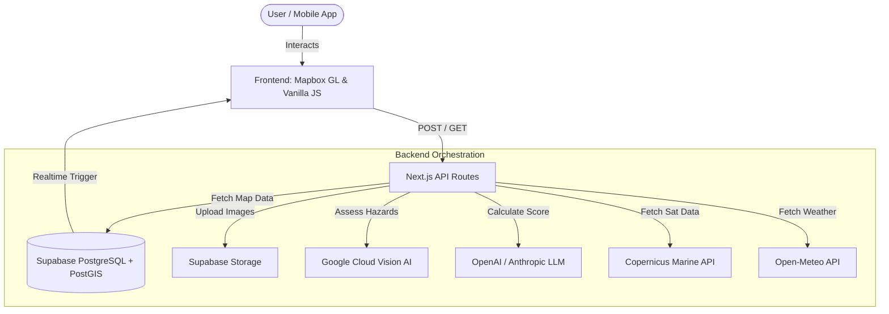
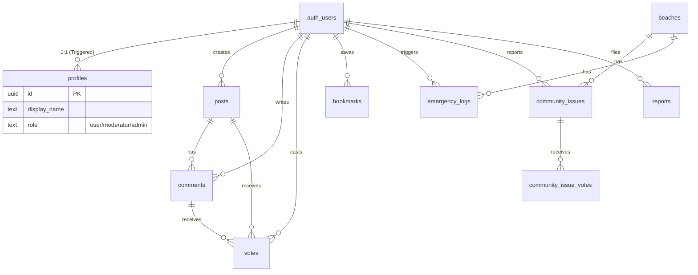

<div align="center">

# 🌊 TidelQ (AntiGravity)
### Reversing Coastal Decline with Real-Time AI Monitoring

[](https://opensource.org/licenses/MIT)
[](https://github.com/your-team/antigravity)
[](https://github.com/your-team/antigravity/issues)
[](https://nextjs.org/)
[](https://supabase.com/)
[](https://tailwindcss.com/)
[](https://postgresql.org/)

</div>

---


---

## 🌐 Live Demo
* **Live Website**: [https://tidelq.onrender.com/landing.html](https://tidelq.onrender.com/landing.html)
* **GitHub Repository**: [[https://github.com/tusharvaskarsharmawork-svg/TidelQ.git](https://github.com/tusharvaskarsharmawork-svg/TidelQ.git)]*TidelQ*

---

## 📖 Project Overview

Coastal ecosystems are under unprecedented pressure from pollution, climate change, and over-tourism. Tourists often enter the water without knowing real-time safety levels, while local authorities rely on static, infrequently updated beach safety flags that ignore invisible environmental health factors (e.g., pathogens, oil spills, chemical waste). 

**TidelQ (AntiGravity)** solves this by providing a real-time "Pulse" of the beach. Synthesizing Copernicus satellite data, community-sourced hazard reports via Vision AI, and environmental metrics, the system’s AI scoring engine provides a dynamic 0-100 "Beach Safety Score". 

By democratizing environmental data, TidelQ empowers beachgoers to make safe recreational choices, provides environmental authorities with crowdsourced, verifiable hazard alerts, and supplies researchers with structured geospatial data to monitor coastal degradation over time.

---

## ✨ Features

### Core Features
| Feature | Status | Description |
| :--- | :--- | :--- |
| **Dynamic AI Safety Scoring** | 🟢 Implemented | Calculates beach safety (0-100) using LLMs based on satellite and report data. |
| **Geofenced Spill-Over Alerts** | 🟢 Implemented | Warns neighboring beaches autonomously when severe hazards are reported nearby. |
| **Automated Image Categorization** | 🟢 Implemented | Google Cloud Vision AI tags uploaded hazard photos (e.g., Oil Spill, Plastic). |
| **Environmental APIs** | 🟢 Implemented | Integrates Copernicus Marine Service (SST, Chlorophyll-a) and Open-Meteo. |

### User Features
| Feature | Status | Description |
| :--- | :--- | :--- |
| **Hazard Reporting** | 🟢 Implemented | Mobile-friendly form to capture GPS-tagged community hazard reports. |
| **Community Forum** | 🟢 Implemented | Public posts, comments, upvotes, downvotes, and bookmarking functionality. |
| **Emergency SOS Logs** | 🟢 Implemented | Dispatch tracking for beach emergencies (Pending/Dispatched/Resolved). |
| **Crowd Density Estimation** | 🟢 Implemented | Estimates local overcrowding based on report frequency and historical data. |

### Admin Features
| Feature | Status | Description |
| :--- | :--- | :--- |
| **Role-based Access Control** | 🟢 Implemented | Granular roles (`user`, `moderator`, `admin`) enforced via Supabase RLS. |
| **Report Moderation** | 🟢 Implemented | Content reporting system for inappropriate forum posts and comments. |

### Mapping Features
| Feature | Status | Description |
| :--- | :--- | :--- |
| **Interactive 3D Map** | 🟢 Implemented | High-performance Mapbox GL JS interface rendering Goan coastlines. |
| **Spatial PostGIS Queries** | 🟢 Implemented | Real-time map rendering based on precise latitude/longitude bounding boxes. |

### Authentication Features
| Feature | Status | Description |
| :--- | :--- | :--- |
| **Supabase JWT Auth** | 🟢 Implemented | Secure login with automatic profile creation via Postgres triggers. |

### Database Features
| Feature | Status | Description |
| :--- | :--- | :--- |
| **Realtime Sync** | 🟢 Implemented | Supabase Realtime enabled for live forum and map updates. |
| **Row Level Security (RLS)** | 🟢 Implemented | Strict data access policies protecting user profiles and voting logs. |

### Security Features
| Feature | Status | Description |
| :--- | :--- | :--- |
| **Payload Limits** | 🟢 Implemented | 15MB size limit on Next.js `submit` API to prevent DDoS/Payload attacks. |

### Performance Features
| Feature | Status | Description |
| :--- | :--- | :--- |
| **CDN Delivery** | 🟢 Implemented | Tailwind and static assets delivered via CDN to minimize bundle sizes. |
| **Async Scoring Updates** | 🟢 Implemented | Fire-and-forget background score recalculation to keep report APIs fast. |

---

## 📸 Screenshots

```
/docs/images/home.png      # Interactive Map Dashboard
/docs/images/map.png       # Geospatial Beach Details
/docs/images/report.png    # Mobile Hazard Reporting Form
/docs/images/profile.png   # User Profile & Activity
/docs/images/admin.png     # SOS & Moderation Dashboard
```

---

## 🛠️ Tech Stack

* **Frontend**: HTML5, CSS3, Vanilla JavaScript (ES6+)
* **Styling**: Tailwind CSS (CDN)
* **Backend**: Next.js 14.1.0 API Routes (Serverless)
* **Database**: PostgreSQL with PostGIS (Supabase)
* **Authentication**: Supabase Auth (JWT)
* **Maps**: Mapbox GL JS
* **Hosting**: Vercel / Render
* **Cloud Storage**: Supabase Storage
* **AI & Machine Learning**: 
  * OpenAI API (GPT-4o) / Anthropic (Claude 3.5 Sonnet)
  * Google Cloud Vision API
* **Data Sources**: Copernicus Marine Service, Open-Meteo

---

## 📂 Folder Structure

```text
antigravity/
├── public/                 # Frontend Static Assets
│   ├── index.html
│   ├── dashboard.html
│   ├── report.html
│   ├── issues.html
│   ├── analytics.html
│   ├── css/
│   ├── js/                 # Vanilla JS logic (map, auth, api, report)
│   └── assets/
├── src/
│   ├── pages/
│   │   └── api/            # Next.js Serverless Functions
│   │       ├── ai/
│   │       ├── beaches/
│   │       ├── issues/
│   │       └── reports/
│   └── lib/                # Shared Backend Modules (DB, LLM, APIs)
├── supabase/
│   └── migrations/         # PostgreSQL Schema & RLS Policies
├── .env.local              # Environment Variables
├── package.json            # Dependencies
└── README.md
```

---

## 🏛️ System Architecture



---

## 🗄️ Database Diagram



---

## 🔐 Authentication Flow

1. **Signup/Login**: User authenticates via Supabase Auth on the frontend (`auth.js`).
2. **Profile Creation**: A Postgres database trigger automatically creates a matching record in the `public.profiles` table.
3. **Session Management**: Supabase returns a JWT, persisted in local storage/cookies.
4. **API Requests**: The JWT is passed as a `Bearer` token in the `Authorization` header to Next.js API routes.
5. **Role & Row-Level Security**: Supabase RLS policies natively enforce that users can only modify their own reports, votes, and profiles, and grants moderation abilities based on the profile `role`.

---

## 🔄 Application Workflow (Hazard Reporting)

1. **User Submits Issue**: User uploads an image, location, and description on the frontend.
2. **Validation & Image Upload**: Next.js receives the payload, uploads the image to Supabase Storage, and fetches a public URL.
3. **Vision AI Analysis**: Image is sent to Google Cloud Vision API for auto-categorization and severity tagging.
4. **Database Storage**: The hazard report is written to PostgreSQL via `lib/db.js`.
5. **Asynchronous Scoring**: A background process is triggered (`api/ai/score.js`), combining the new report, satellite metrics, and crowd data. The LLM recalculates the overall beach safety score.
6. **Geofenced Spill-over**: If the hazard is severe, the API queries PostGIS for neighboring beaches (< 5km) and drops their scores preemptively.
7. **Map Update**: Supabase Realtime pushes the new score and report markers to active frontend clients instantly.

---

## 📡 API Documentation

| Endpoint | Method | Description |
| :--- | :--- | :--- |
| `/api/beaches` | GET | Retrieves a list of all beaches and their current AI safety score. |
| `/api/beaches/[id]` | GET | Retrieves historical trends and metadata for a specific beach. |
| `/api/reports/submit` | POST | Accepts Base64 images and GPS data. Triggers Vision AI & score recalculation. |
| `/api/issues` | GET/POST | Fetches or creates new community forum issues. |
| `/api/issues/vote` | POST | Toggles user upvote/downvote for a specific community issue. |
| `/api/ai/score` | POST | Internal endpoint forcing an LLM score recalculation for a beach. |

---

## 🚀 Live Demo & Deployment (No Installation Required)

The application is **fully deployed and live**, meaning there is no need for local installation or setup to access and use TidelQ.

### 🌐 Accessing the Live App
Simply open the live URL in your web browser:
* **Live Website**: [https://tidelq.onrender.com/landing.html](https://tidelq.onrender.com/landing.html)

---

## 🛠️ Local Development (Optional)

If you wish to run the project locally for development or customization purposes, follow the steps below:

### 1. Clone the repository
```bash
git clone https://github.com/your-team/antigravity.git
cd antigravity
```

### 2. Install dependencies
```bash
npm install
```

### 3. Setup Environment Variables
Copy the `.env.local` example and populate the variables.
```bash
cp .env.local.example .env.local
```

### 4. Database Setup
Run the SQL migration files located in `supabase/migrations/` in your Supabase SQL Editor to generate the schema, triggers, and RLS policies.

### 5. Run Locally
```bash
npm run dev
```
Navigate to `http://localhost:3000/index.html` to access the application.

---

## 🔑 Environment Variables

| Variable | Description |
| :--- | :--- |
| `SUPABASE_URL` | Backend Supabase project URL |
| `SUPABASE_ANON_KEY` | Public Anon key for basic requests |
| `SUPABASE_SERVICE_KEY` | Service role key for admin-level database bypass (Do NOT expose) |
| `NEXT_PUBLIC_SUPABASE_URL` | Frontend Supabase URL |
| `NEXT_PUBLIC_SUPABASE_ANON_KEY` | Frontend Supabase Anon Key |
| `OPENAI_API_KEY` | OpenAI API Key for GPT-4o LLM scoring |
| `COPERNICUS_USERNAME` | *(Optional)* Copernicus Marine Data auth |
| `COPERNICUS_PASSWORD` | *(Optional)* Copernicus Marine Data auth |
| `NEXT_PUBLIC_APP_URL` | Application root URL (e.g., localhost:3000) |

*⚠️ Ensure `SUPABASE_SERVICE_KEY` and `OPENAI_API_KEY` are strictly server-side and never prefixed with `NEXT_PUBLIC_`.*

---

## ☁️ Deployment

### Deploying on Vercel or Render
Because the backend relies heavily on Next.js API Routes, Vercel is the optimal hosting provider, though Render fully supports Next.js via standard Node.js build commands:
1. Connect your GitHub repository to Render/Vercel.
2. Set the build command to `npm run build` and start command to `npm run start`.
3. Map all environment variables into the project settings.

### Supabase Integration
Ensure the database URL matches your deployed environment. Adjust Supabase "Allowed Origins" in the Auth settings to permit logins from your live production URL.

---

## 🛡️ Security

* **Row Level Security (RLS)**: Enforced comprehensively. Users cannot tamper with votes or delete others' reports.
* **Payload Limits**: `/api/reports/submit` restricts bodies to `15mb` using Next.js config to prevent memory exhaustion attacks.
* **Data Sanitization**: Image uploads enforce mime-type checking (jpeg/png only).

*(Note: There is a minor security weakness in `submit.js` where the Vision AI fallback blindly accepts client-provided `severity` if AI fails. Production systems should strictly validate client fallback payloads.)*

---

## ⚡ Performance Optimizations

* **Asynchronous Scoring**: LLM recalculations are performed via fire-and-forget Promises. Users submitting a report are not blocked waiting for GPT-4o to finish scoring.
* **Vanilla JS DOM Manipulation**: Bypassing heavy React hydration on the client-side allows Mapbox GL JS to maintain 60 FPS even when rendering high-density GeoJSON polygons.
* **Tailwind CDN**: Caches CSS globally at the edge without requiring build-time overhead for the MVP.

---

## 🔮 Future Improvements

### Planned
* **Predictive Modeling**: Train a model using historical data to predict safety score drops (e.g., algal bloom 24 hours before it happens).
* **Wearable Integration**: Send instant push-notifications to swimmer smartwatches.

### Suggested
* **Crowdsourced Rewards**: A gamified "Coastal Guardian" system rewarding users with local perks for maintaining high report accuracy.

### Nice to Have
* **Offline Mode**: Local caching using Service Workers to allow tourists to submit hazard reports without cell reception.

---


## 🤝 Contributing

1. Fork the Project
2. Create your Feature Branch (`git checkout -b feature/AmazingFeature`)
3. Commit your Changes (`git commit -m 'Add some AmazingFeature'`)
4. Push to the Branch (`git push origin feature/AmazingFeature`)
5. Open a Pull Request

---

## 📜 License

Distributed under the MIT License. See `LICENSE` for more information.

---

## 🙌 Credits
* Developed for **Susegad Sprint 2026**.
* Special thanks to **Mapbox**, **Supabase**, and the **Copernicus Marine Environment Monitoring Service**.
* TEAM - NEURAL PAIR
* - AKANKSHA KUMARI (akanksha312kumari@gmail.com)
  - TUSHAR VASKAR SHARMA (tusharvaskarshama@gmail.com)

---

